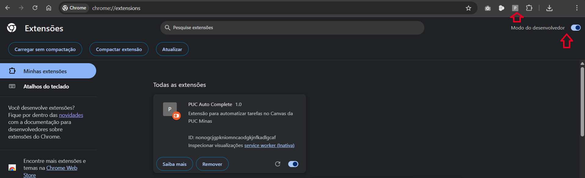
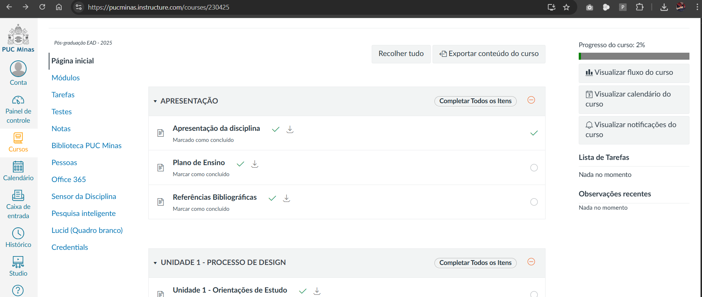
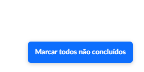

# PUC Auto Complete

Automatize tarefas repetitivas no Canvas da PUC Minas com esta extensão para Google Chrome!

## Objetivo

Este projeto foi criado para automatizar tarefas chatas e repetitivas enfrentadas durante a pós-graduação em Engenharia de Software na PUC Minas. Com ele, você pode marcar atividades como concluídas e baixar vídeos das aulas de forma simples e rápida, diretamente pela interface do Canvas.

## Instalação

1. Baixe ou clone este repositório para o seu computador.
2. Acesse `chrome://extensions/` no Google Chrome.
3. Ative o **Modo do desenvolvedor** no canto superior direito.
4. Clique em **Carregar sem compactação** e selecione a pasta do projeto.
5. Pronto! A extensão estará ativa.

## Como usar

1. Entre na página da matéria no Canvas da PUC Minas.
2. Aguarde o carregamento completo da página (a extensão só carrega após tudo estar pronto).
3. Dois ícones aparecerão ao lado de cada atividade:
   - **Ícone de download**: baixa o vídeo da atividade (se houver).
   - **Ícone de check**: marca ou desmarca a atividade como concluída no sistema.
4. Na página de Módulos, você também verá o botão "Marcar todos não concluídos" no canto inferior direito. Ele processa automaticamente todas as atividades pendentes, marcando-as como feitas em lote e exibindo um resumo ao final.

## Funcionalidades

- **Download de vídeos**: Baixe rapidamente os vídeos das aulas com um clique, sem precisar abrir o player ou procurar o link do arquivo.
- **Marcar como concluído**: Automatize o processo de marcar atividades como feitas. A extensão abre a página da atividade em segundo plano, clica automaticamente no botão "Marcar como feito" e fecha a aba, mantendo o foco na sua navegação.
- **Marcar todos não concluídos (lote)**: Com um clique, a extensão percorre os itens pendentes e tenta marcar todos como concluídos. Ao final, você vê um resumo com sucessos, falhas e itens ignorados, e a página é recarregada para refletir o novo status.

## Detalhes Técnicos

### Download de Vídeos
- Ao clicar no ícone de download, a extensão abre a página da atividade em segundo plano, localiza o vídeo MP4 e inicia o download automaticamente usando a API de downloads do Chrome.
- O arquivo é salvo com o nome da atividade, facilitando a organização dos conteúdos.

### Marcar Atividade como Concluída
- Ao clicar no ícone de check, a extensão abre a página da atividade em uma nova aba (sem foco), localiza o botão de id `mark-as-done-checkbox` e clica nele automaticamente.
- Após marcar como feito, a aba é fechada e a página principal é recarregada para refletir o novo status da atividade.

### Marcar todos não concluídos (Lote)
- Ao acionar o botão "Marcar todos não concluídos", a extensão identifica automaticamente as atividades pendentes na página de Módulos.
- Para cada item, ela abre a página da atividade em segundo plano, tenta acionar o botão de conclusão (quando houver) e fecha a aba, sem tirar o foco da sua navegação.
- Ao final do processamento, é exibido um resumo com a quantidade de itens marcados, falhas e itens ignorados (por não possuírem o botão de conclusão disponível).
- Em seguida, a página é recarregada para atualizar os ícones de status.

## Créditos

Desenvolvido por **Paulo Sérgio Júnior** durante a pós-graduação em Engenharia de Software na PUC Minas.

---

Se este projeto te ajudou, deixe uma estrela no repositório! ⭐